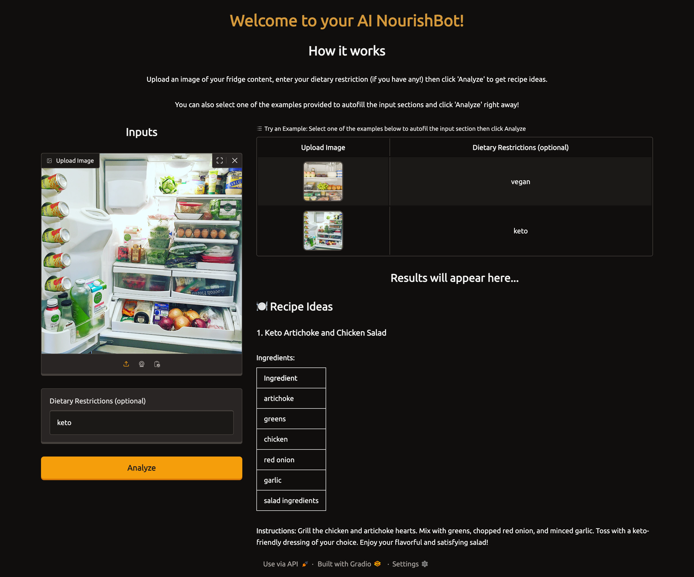

# AI NourishBot (aka AI Dietary Crew)



AI-powered nutrition assistant built with CrewAI and Gradio. NourishBot uses multimodal input and multi-agent reasoning to analyze meals, provide nutritional insights, and suggest personalized recipes through an interactive web app. This project demonstrates the use of CrewAI and other AI tools to deliver insightful and personalized nutritional feedback.

⚠️ Note: This repo is inspired by an IBM Coursera lab but does not include any IBM lab credentials or proprietary course materials. All code here has been adapted and extended by me for personal learning and portfolio purposes.
I attempted to port the Coursera IBM Watson tutorial to OpenAI/Ollama. I discovered that while CrewAI offers powerful abstractions, it introduces brittleness around JSON schema enforcement and tool calling. I adjusted by simplifying the workflow to highlight recipes, which demonstrates the orchestration concept while ensuring the app is reliable and user-friendly.

## Features

- **Ingredient Detection**  
  Detects ingredients from user-uploaded images using a vision AI model.

- **Dietary Filtering**  
  Filters detected ingredients based on user-defined dietary restrictions (e.g., vegan, gluten-free).

- **Calorie Estimation**  
  Estimates total calories from the detected ingredients.

- **Health Evaluation**  
  Summarizes the overall healthiness of the meal and provides a health evaluation.

- **Recipe Suggestion**  
  Generates recipe ideas based on the filtered ingredients and dietary restrictions.

## How It Works

The project is built using the CrewAI framework, which organizes agents and tasks into workflows for two primary use cases:

1. **Recipe Workflow**  
   Detects ingredients, filters them based on dietary restrictions, and suggests recipes.

## Installation

### Prerequisites

- Python 3.8+
- Virtual environment (optional but recommended)
- Git
- OpenAI API Key

### Setup Instructions

1. **Clone the repository**:

   ```bash
   git clone https://github.com/marnibrewster/ai-nourishbot.git
   cd ai-nourishbot
   ```

2. **Create and activate a virtual environment**:

   ```bash
   python3.11 -m venv venv
   source venv/bin/activate  # On Windows: venv\Scripts\activate
   ```

3. **Install the required dependencies:**

   ```bash
   pip install -r requirements.txt
   ```

4. **Set up your LLM envs:**

   ```bash
   cp .env.example .env # and paste your OpenAI key
   ```

### Run the Application

```bash
python app.py
```

View the UI in your browser at http://127.0.0.1:5000

## File Structure

```
Smart-Nutritional-App-Crew/
│
├── config/
│   ├── agents.yaml               # Configuration for agents
│   └── tasks.yaml                # Configuration for tasks
│
├── src/
│   ├── crew.py                   # Crew definitions (agents, tasks, workflows)
│   ├── tools.py                  # Tool definitions for ingredient detection, filtering, etc.
│   └── main.py                   # Main script for running the application
│
├── requirements.txt              # Python dependencies
└── README.md                     # Project documentation
```

## License

This project is licensed under the MIT License. See the LICENSE file for details.
